# HAZOP Software - System Architecture Diagram

## Complete System Architecture

---

## Simplified Data Flow Architecture

---

## HAZOP Analysis Workflow

```mermaid
sequenceDiagram
    participant User as 👤 Safety Engineer
    participant UI as 🖥️ Frontend
    participant API as ⚡ Backend API
    participant DB as 💾 Database
    participant AI as 🤖 Gemini AI

    User->>UI: Select Deviation
    UI->>API: GET /api/hazop/deviations/{id}/causes
    API->>DB: Query causes
    DB-->>API: Return causes
    API-->>UI: Causes list
    UI-->>User: Display causes

    User->>UI: Click "AI Insights"
    UI->>UI: Show context form
    User->>UI: Enter context (equipment, fluid, conditions)

    UI->>API: POST /api/gemini/suggest-causes
    Note over API: Validate & Process
    API->>AI: Generate suggestions with context
    Note over AI: NLP Processing<br/>Industry Knowledge<br/>Pattern Matching
    AI-->>API: Return 5 suggestions with confidence
    API->>API: Parse & validate JSON
    API-->>UI: Suggestions array
    UI-->>User: Display AI suggestions

    User->>UI: Click "+" to add suggestion
    UI->>API: POST /api/hazop/causes
    API->>DB: Insert new cause
    DB-->>API: Confirm save
    API-->>UI: Success response
    UI-->>User: Update worksheet (auto-saved)

    Note over User,AI: Time: 3-5 seconds total<br/>vs 15-20 min manual
```

---

## Database Schema Relationships

---

## Technology Stack Overview

---

## Feature Module Map

---

## Deployment Architecture (Production Ready)

---

## AI Integration Architecture

```mermaid
graph LR
    subgraph "User Input"
        Context[Context Form<br/>• Equipment Type<br/>• Fluid Properties<br/>• Operating Conditions<br/>• Historical Incidents]
    end

    subgraph "Frontend Processing"
        Validation[Input Validation<br/>• Required fields<br/>• Format check]
        API_Call[API Request<br/>POST /api/gemini/suggest]
    end

    subgraph "Backend Processing"
        Auth[JWT Validation]
        Service[Gemini Service<br/>• Prompt Engineering<br/>• Context Formatting]
        ThreadPool[ThreadPoolExecutor<br/>Non-blocking Async]
    end

    subgraph "AI Processing"
        Gemini[Google Gemini AI<br/>• NLP Analysis<br/>• Knowledge Retrieval<br/>• Pattern Matching<br/>• Confidence Scoring]
    end

    subgraph "Response Processing"
        Parse[JSON Parsing<br/>• Extract suggestions<br/>• Validate structure]
        Enrich[Data Enrichment<br/>• Add metadata<br/>• Format response]
    end

    subgraph "User Display"
        UI[Interactive Panel<br/>• Suggestions list<br/>• Confidence badges<br/>• Add buttons]
        Worksheet[HAZOP Worksheet<br/>• Auto-populate<br/>• Save to DB]
    end

    Context --> Validation
    Validation --> API_Call
    API_Call --> Auth
    Auth --> Service
    Service --> ThreadPool
    ThreadPool --> Gemini
    Gemini --> Parse
    Parse --> Enrich
    Enrich --> UI
    UI --> Worksheet

    style Context fill:#3B82F6,stroke:#1E40AF,color:#fff
    style Gemini fill:#E2E8F0,stroke:#CBD5E1,color:#4B5563
    style ThreadPool fill:#EF4444,stroke:#DC2626,color:#fff
    style Worksheet fill:#10B981,stroke:#059669,color:#fff
```

---

## Dashboard Data Aggregation Flow

---

**Note**: These diagrams provide a comprehensive visual representation of the HAZOP software architecture, data flows, and system interactions. Each diagram focuses on a specific aspect of the system for clarity and understanding.
